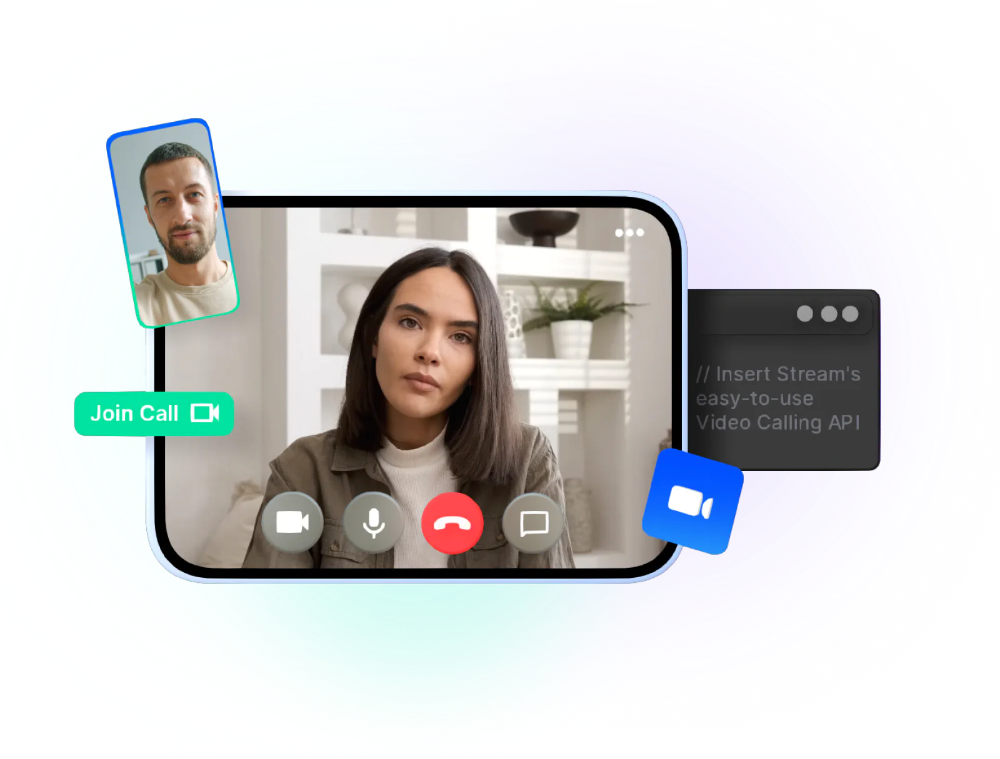

# Flutter tutorials for the [Stream Video SDK](https://getstream.io/video/sdk/flutter/)

The Flutter SDK for Video & Audio provides pre-built widgets so developers can move quickly to integrate real-time video capabilities in their applications. 
Using our SDK, developers can opt to use our customizable out-of-the-box solution or write their own UIs using our low-level SDK – all while avoiding the hard parts of multi-platform development.

- [Register](https://getstream.io/video/) to get an API key for Stream Video

This repository contains the example projects for the [tutorials](https://getstream.io/video/sdk/flutter/) for the Stream Video Flutter SDK.

## Flutter Video Calling Tutorial

📚 [Video Calling Tutorial](https://getstream.io/video/sdk/flutter/tutorial/video-calling/)   |   💻 [Video Calling Repository](https://github.com/GetStream/flutter-video-tutorials/tree/main/video_calling_tutorial)

The Flutter Video Calling tutorial shows you how to quickly build a Video Calling app leveraging Stream's Video API and the Stream Video Flutter components. 
The underlying API is very flexible and allows you to build nearly any type of video experience.

## Flutter Livestreaming Tutorial

📚 [Livestreaming Tutorial](https://getstream.io/video/sdk/flutter/tutorial/livestreaming/)   |   💻 [Livestreaming Repository](https://github.com/GetStream/flutter-video-tutorials/tree/main/livestreaming_tutorial)

The Flutter livestreaming tutorial shows you how to quickly build a Livestreaming app leveraging Stream's Video API and the Stream Video Flutter components. 
The underlying API is very flexible and allows you to build nearly any type of video experience.

## Flutter Audio Rooms Tutorial

📚 [Audio Rooms Tutorial](https://getstream.io/video/sdk/flutter/tutorial/audio-room/)   |   💻 [Audio Rooms Repository](https://github.com/GetStream/flutter-video-tutorials/tree/main/audioroom_tutorial)

The Flutter audio room tutorial shows you how to quickly build an Audio Room app leveraging Stream's Video API and the Stream Video Flutter components. 
The underlying API is very flexible and allows you to build nearly any type of video experience.
