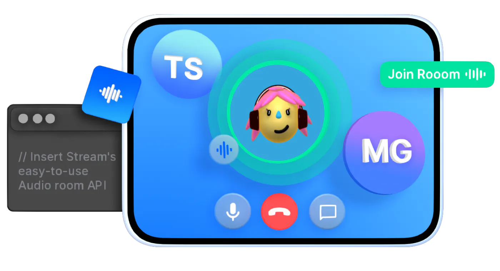

## Flutter Audio Rooms Tutorial

📚 [Audio Rooms Tutorial](https://getstream.io/video/sdk/flutter/tutorial/audio-room/)   |||   💻 [Audio Rooms Repository](https://github.com/GetStream/flutter-video-tutorials/tree/main/audioroom_tutorial)

The Flutter audio room tutorial shows you how to quickly build an Audio Room app leveraging Stream's Video API and the Stream Video Flutter components.
The underlying API is very flexible and allows you to build nearly any type of video experience.